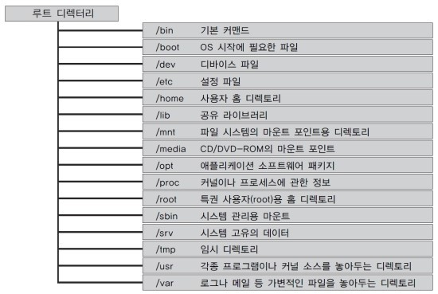

# 2021-linux

root directory   


## command   
cd 디렉토리변경    
cd . (현재디렉토리) cd .. (상위 디렉토리)    

```
$ cd   
user@:~$   
    
$ cd ./Music   
user@:~/Music  
``` 
   
ls [옵션] 파일 출력    

```
$ ls -l
-rw-rw-r-- 1 user user 3301828 2월 14 18:00 text.txt

$ ls -a
.  sample.mp3 sample2.mp3 sample2.wav 
.. sample.ogg
```
   
rm [옵션]   
```
$ rm file

$ rm -i file
rm: remove file 'file'? (y,n 입력)

```
   
mkdir [옵션]
```
$ mkdir test
```
   
man [옵션]   
| 옵션 | 내용 | page | 내용 | page | 내용 |
|:----:|:----:|:----:|:----:|:----:|:----:|
|man|#### man 명령어의 설명 |1|#### 일반 명령어 관련 메뉴얼|6 |#### 게임과 화면보호기에 대한 메뉴얼|
| -a |#### 찾고자 하는 명령어의    man 페이지를 모두 출력|2 |#### 시스템 호출 관련 메뉴얼|7|#### 리눅스 파일표준,프로토콜, 시그널 목록 정보|
| -f |#### whatis 명령과 동일키워드와 동일한 man 페이지 출력|3|#### C표준 라이브러리 함수 관련 메뉴얼|8|#### 시스템 관리 명령어 |
| -k |#### apropos 명령과 동일키워드가 포함된 man 페이지 출력|4 |#### 장치 또는 특수 파일에 대한 메뉴얼 | 9 |#### 커널 관리 정보가 들어있는 메뉴얼|
| -w |#### 찾고자 하는 문자의 man 페이지가 있는 위치 출력|5|#### 특정 파일들에 대한 정보가 있응 메뉴얼 | |  |
