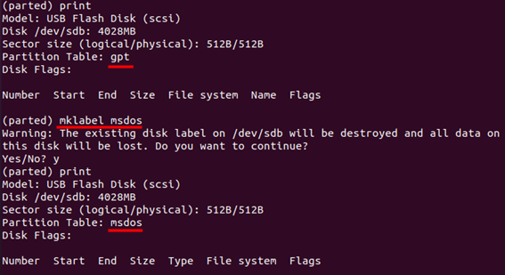
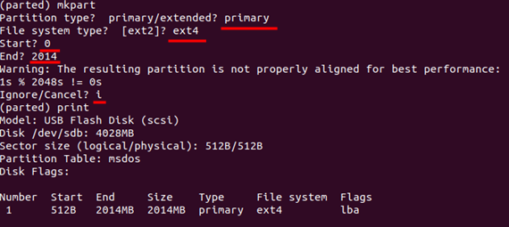

# file
    
## fdisk   
```
# 현재 디스크 및 파티션 보기
$ sudo fdisk -l

$ sudo fdisk /dev/sdb 

Welcome to fdisk (util-linux 2.34).
Changes will remain in memory only, untile you decide to write them.
Be care ful before using the write command.

Command (m for help) :

m 메뉴보기
p 파티션 설정 보기
a 부팅 파티션 설정
d 파티션 삭제
w 파티션 설정 저장
n 파티션 추가
t 파티션 종류 변경
```
    
## parted   
<u>fdisk랑 다르게 변경사항 즉시 기록 주의!</u>

```
$ sudo parted /dev/sdb
Welcome to GNU parted! Type 'help' to view a list of commands
(parted) 입력
```
print   

    
mkpart    
   
```
# 부팅 파티션 설정
(parted) set 1 boot on

# 파티션 사이즈 변경 / 사이즈가 작아진다면 데이터 잃음 경고
(parted) resizepart 2 [파티션 넘버]
End? 4000

# 파티션 제거
(parted) rm 2 [파티션 넘버]
```
   
## mount    
하드웨어 장치를 linux에서 사용하기 위해 인식시켜주는 
mount [옵션][디바이스명][마운트할 디렉토리]
```
# fstab 파일에 언급된 모든 파일 시스템 마운트
$ sudo mount -a 

# mount 가능한지 점검
$ sudo mount -f 

# mount 해제 [디바이스명]
$ sudo umount /dev/sdb1

# mount 확인 [디바이스명]
$ sudo mount | grep /deb/sdb1
```
### 자동마운트

